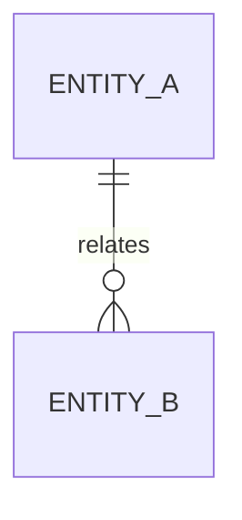

# 데이터베이스 설계: 주제

- 상태: `DRAFT` <!-- DRAFT | APPROVED -->
- 최종 검토일: `<YYYY-MM-DD>`
- 관련 migration·ADR: `<링크>`

## 목적과 범위

- 해결할 데이터 문제:
- 포함할 schema·query:
- 비범위:

## 데이터 소유권

| 데이터·테이블 | 소유 도메인 | 변경 권한 | 읽기 계약 |
|---|---|---|---|
|  |  |  |  |

## 모델과 관계

필요한 경우 ER diagram을 사용한다.

## 테이블·컬럼·제약

| 항목 | 설계·변경 | 불변 조건 | 호환성·위험 |
|---|---|---|---|
|  |  |  |  |

## 트랜잭션과 정합성

- 트랜잭션 경계:
- 동시성 제어:
- 강한·최종 정합성:
- 멱등성:

## Migration

- Forward:
- 기존 데이터 변환:
- 호환 배포 순서:
- 복구 또는 roll-forward:
- lock·대용량 영향:

적용된 migration 이력을 덮어쓰지 않는다.

## 주요 Query와 성능

- query 위치와 목적:
- index 근거:
- 실행 계획·측정:
- 데이터 증가 시 영향:

## 보안과 보존

- 민감 데이터:
- 접근 제한:
- 보존·삭제 정책:
- 로그·백업 주의사항:

## 검증

- schema·migration 테스트:
- query·mapping 테스트:
- 정합성·동시성 테스트:
- 성능 확인:
