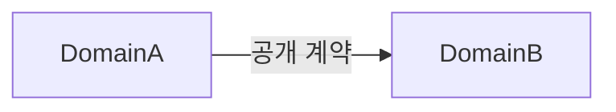

# 도메인 지도

- 상태: `DRAFT` <!-- DRAFT | APPROVED -->
- 최종 검토일: `<YYYY-MM-DD>`
- 관련 Architecture·ADR: `<링크>`

## 도메인 목록

| 도메인 | 업무 책임 | 핵심 용어 | 소유 데이터 | 공개 계약 | 금지 접근 |
|---|---|---|---|---|---|
|  |  |  |  |  |  |

## 관계

필요한 경우 실제 의존성과 데이터 흐름을 표현한다.

## 도메인별 불변 조건

### 도메인명

- 소유 상태:
- 주요 상태 전이:
- 반드시 지켜야 할 규칙:
- 외부 시스템 의존성:

## 도메인 간 상호작용

| 호출자 | 제공자 | 계약 | 정합성 | 실패 처리 |
|---|---|---|---|---|
|  |  |  |  |  |

## 경계가 불확실한 영역

- `<추가 검토가 필요한 책임>`
