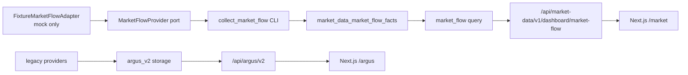

# 현재 아키텍처 기준선

- 상태: `APPROVED`
- 최종 검토일: `2026-07-22`
- 관련 ADR: `ADR-001`, `ADR-002`

이 문서는 1차 `market_flow` 수직 기능 구현 후의 실제 상태를 설명한다. 새 시장 데이터 경계와 레거시 `argus_v2`가 함께 존재하며, 레거시 삭제는 아직 승인·실행하지 않았다.

## 1. 시스템 목적과 경계

- 제품 목적: KRX 시장 수급, KOSPI200 종목, 선물·옵션 상태를 짧은 시간 안에 판독하는 시장 데이터 터미널
- 현재 새 기능: KOSPI 현물과 KOSPI200 선물·콜·풋의 개인·외국인·기관 수급을 mock fixture로 저장·조회·표시
- 현재 레거시 기능: 기존 파생·뉴스·시장 반응 API와 `/argus` 화면
- 비범위: 주문·계좌, 자동매매, 투자 추천

## 2. 현재 시스템 컨텍스트

## 3. 새 `market_flow` 구성 요소

| 구성 요소 | 책임 | 의존성 |
|---|---|---|
| `market_flow/domain.py` | `MarketFlowFact`, source, mode, scope, segment, quality, 시각과 수급 값 정의 | Python 표준 라이브러리만 사용 |
| `market_flow/ports.py` | provider, writer, reader protocol | domain |
| `market_flow/adapters/fixture.py` | normal·partial·empty·stale·error mock 시나리오 생성 | port가 요구하는 domain fact |
| `market_flow/collect.py` | provider 결과를 writer에 batch 저장 | port |
| `market_flow/repository.py` | SQLite 멱등 저장과 mode별 최신 fact 조회 | `market_data/db.py`, domain |
| `market_flow/queries.py` | 네 segment의 estimate·confirmed 조립과 freshness·coverage 판정 | reader port, domain |
| `market_flow/api.py` | 저장된 fact를 Pydantic HTTP 계약으로 변환 | reader port, query; adapter에 의존하지 않음 |
| `market_data/cli.py` | fixture 수집을 API 프로세스와 분리 실행 | fixture adapter, collector, repository |
| `market_terminal/` | Zod 계약, server fetch, 3탭 shell, 수급 패널 | `/api/market-data/v1/*`만 사용 |

## 4. 의존성 및 실행 경계

- 허용 방향: adapter → port/domain → repository → query → API → frontend contract/UI
- `domain.py`는 FastAPI, SQLite, frontend, 증권사 payload를 import하지 않는다.
- API 요청은 provider adapter를 호출하지 않고 저장된 fact만 조회한다.
- 새 `backend/src/market_data/`, `frontend/src/market_terminal/`, `frontend/src/app/market/`는 `argus_v2`를 참조하지 않는다.
- `scripts/check-market-boundaries.sh`가 위 레거시 참조와 API→adapter 의존을 검사한다.
- fixture와 live는 `data_mode`로 조회부터 UI까지 분리한다. API 오류는 frontend fixture fallback으로 숨기지 않는다.

## 5. 데이터 소유권과 정합성

| 데이터 | 소유자 | 정합성 규칙 |
|---|---|---|
| 새 시장 수급 fact | `market_data_market_flow_facts` | `(source, data_mode, source_record_id)` unique, 중복 insert 무시 |
| 레거시 snapshot·provider run | `argus_v2_*` 테이블 | 기존 계약 유지 |

- `estimate`와 `confirmed`는 별도 row이며 서로 덮어쓰지 않는다.
- 현재 조회는 segment·quality별 가장 최근 fact 하나를 선택한다.
- `observed_at`, `collected_at`은 저장 시 UTC로 정규화하고 API에서 timezone-aware ISO 8601로 반환한다.
- `trade_date`는 해당 KRX 거래일을 보존한다.
- 현재 SQLite transaction 경계는 repository connection 단위다.

## 6. 화면과 공개 경계

- `/market`: 저장된 mock 시장 수급을 표시하는 대시보드
- `/market/stocks`: 다음 KOSPI200 종목 수직 기능의 독립 URL placeholder
- `/market/derivatives`: 다음 파생 수직 기능의 독립 URL placeholder
- `/argus`: 레거시 화면 유지
- `/api/market-data/v1/dashboard/market-flow`: 새 저장 기반 시장 수급 API
- `/api/argus/v2/*`: 레거시 API 유지

새 화면은 `DEMO · NOT LIVE`, source, `estimate`/`confirmed`, fresh/stale/missing을 숨기지 않는다.

## 7. 성공·실패 흐름

- 정상: fixture CLI → 8 facts 저장 → API 최신 조회 → Zod 검증 → 네 segment 카드 표시
- 부분: 일부 segment만 저장되면 누락 row를 유지하고 전체 상태를 `partial`로 표시
- stale: 마지막 fact를 유지하되 freshness를 `stale`로 표시
- empty/live 미구현: 고정된 네 row를 `missing`으로 반환
- provider error: CLI가 non-zero로 종료하며 빈 데이터를 성공처럼 저장하지 않음
- API 연결 실패: frontend가 명시적인 오류 상태를 표시하며 fixture로 대체하지 않음

## 8. 런타임과 검증 기준

- Python 3.11 `.venv`에서 backend 의존성과 테스트를 검증했다. 저장소 차원의 런타임 고정은 아직 미결정이다.
- frontend는 Node 26.5.0, pnpm 11.13.0에서 검증했다.
- fixture 적재와 API/frontend는 별도 프로세스로 실행한다.
- 전체 검증 명령은 `project-docs/project-profile.md`를 기준으로 한다.

## 9. 남은 단계와 위험

- 현재 adapter는 mock fixture뿐이며 KIS·LS·키움·KRX live 계약은 연결하지 않았다.
- KRX 영업일·휴일 캘린더와 실제 장 마감 확정 시각은 live 단계에서 검증해야 한다.
- provider run, retry/backoff, rate limit, collector lease는 새 경계로 아직 이관하지 않았다.
- 종목 200개, 차트, 옵션체인과 개별주식 파생은 placeholder만 존재한다.
- 데이터 보존 기간과 SQLite 용량·writer contention 기준은 미결정이다.
- 레거시 코드와 DB 계약의 제거는 별도 승인이 필요하다.
