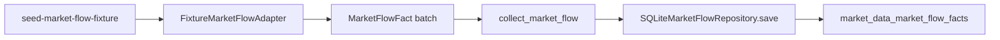
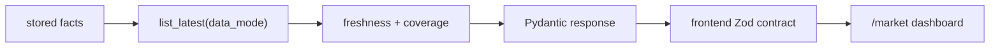

# Market Flow 수집·조회 흐름

- 상태: `CURRENT`
- 최종 검토일: `2026-07-22`

## 목적

API key 없이 첫 수직 기능의 전체 경계를 검증하되, 나중에 live adapter를 붙일 때 API와 UI를 다시 작성하지 않도록 운영과 같은 저장 기반 흐름을 사용한다.

## 수집 흐름



실행 명령:

```bash
pnpm seed:market-flow
```

CLI는 `normal`, `partial`, `empty`, `stale`, `error` 시나리오와 timezone-aware `--as-of`, 별도 `--db-path`를 지원한다. 정상 시 fetched·inserted count를 JSON으로 출력하고 provider error는 non-zero로 종료한다.

## 조회 흐름



- API는 collection adapter를 import하거나 호출하지 않는다.
- frontend server fetch는 항상 명시적인 `data_mode=mock`으로 1차 화면을 조회한다.
- 패널은 estimate와 simulated confirmed를 나란히 표시하고 source와 관측 시각을 노출한다.

## 실패와 격리

| 상황 | 결과 |
|---|---|
| 일부 segment만 수집 | 존재하는 row는 표시하고 나머지는 `missing`, 전체는 `partial` |
| 오래된 fact | 마지막 값을 유지하면서 `stale` 표시 |
| 빈 저장소 또는 live 미구현 | 네 row를 유지하고 fact는 null, 전체는 `missing` |
| fixture provider error | CLI 실패, 빈 성공 snapshot 생성 안 함 |
| backend/API 오류 | `/market`이 명시적 API 오류를 표시, frontend mock fallback 없음 |

## live 전환 시 유지할 경계

- `FixtureMarketFlowAdapter` 대신 capability port를 구현하는 live adapter를 추가한다.
- live fact는 `data_mode=live`와 실제 source를 사용한다.
- 장중 증권사 값은 `estimate`, KRX 마감 값은 별도 `confirmed`로 저장한다.
- 수집 프로세스와 API 요청 프로세스는 계속 분리한다.
- authentication, rate limit, retry/backoff, provider run과 lease는 live adapter 단계에서 추가한다.
